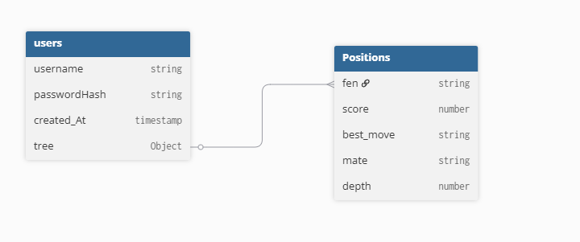

# ReChess

## WebSite in Typescript for chess studies and analysis

## Instalation 

librairies :

back-end :

    -bcrypt
    -express 
    -cors
    -mongodb

front-end :

    -react-chessboard
    -chess.js
    -recharts

launch :

    back-end : 
        (npx tsc to compile)
        node dist/server.js

    front-end : npm start

## Site

The main feature is the ability to create your own search tree with personal comments.
It is saved in the user database as a JSON object:
{id_leaf : [fen:string, commentaire : string, childs [id_leaf_childs]  ]}

To optimize performance, if the score for a position already exists in the database, it is retrieved directly; otherwise Stockfish calculates the score and saves it in the database.

It is also possible to import or export a tree to share it.

Also, you can import and analysis a game.

## Databases

