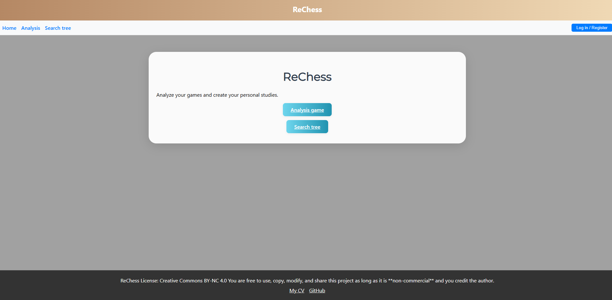
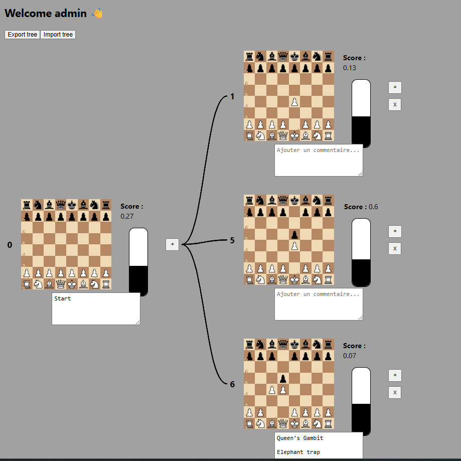
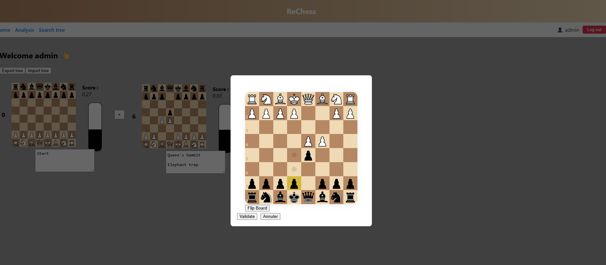
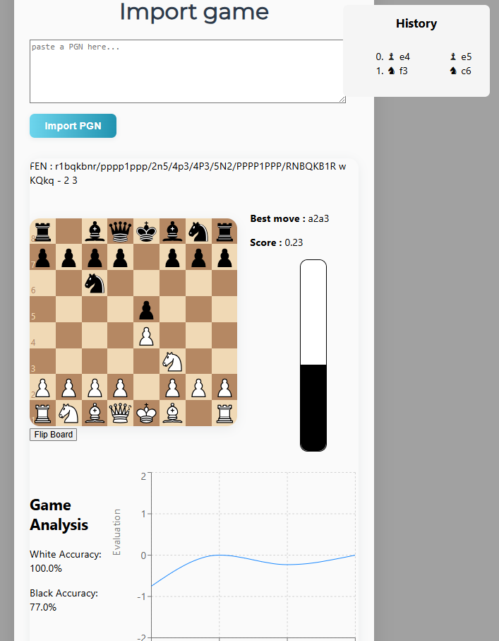

# ReChess

## WebSite in Typescript for chess studies and analysis

## Instalation 

librairies :

back-end :
    -bcrypt
    -express 
    -cors
    -mongodb

front-end :

    -react-chessboard
    -chess.js
    -recharts

launch :

    back-end : 
        (npx tsc to compile)
        node dist/server.js

    front-end : npm start

## Site

The main feature is to create his own search tree with personnals comments. It's save in the user database as a json 
{id_leaf : [fen:string, commentaire : string, childs [id_leaf_childs]  ]}

To optimize, if the score position is already in the database you get it directly else stockfish calculates the score and save in the database.

It's possible to import/export a tree to share it

Also, you can import and analysis a game.

